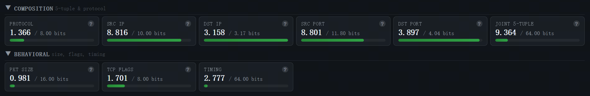
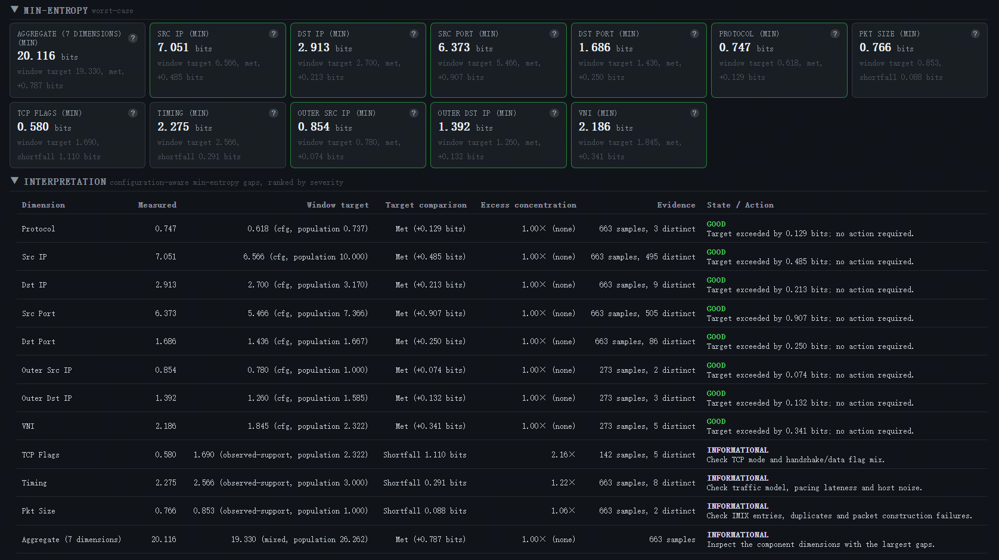
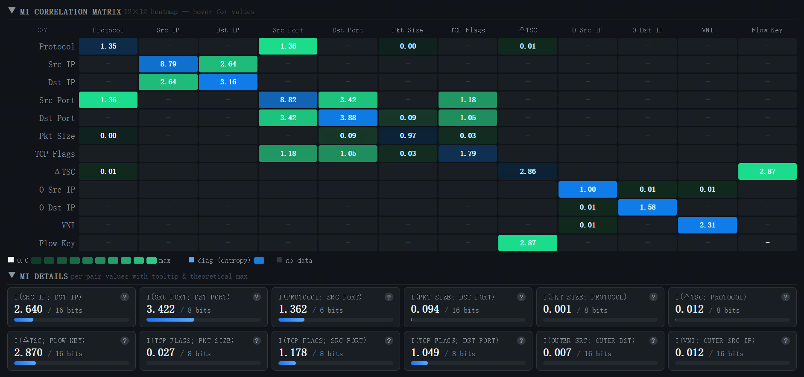
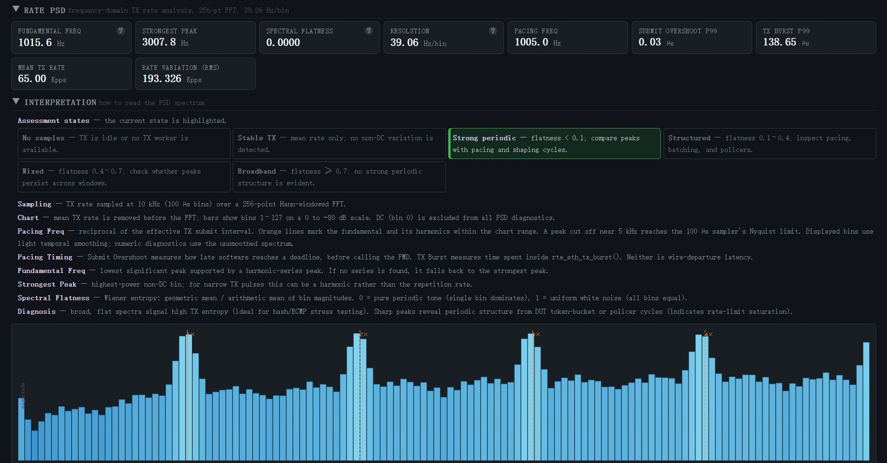

# Bless

[](https://github.com/erocpil/bless/actions/workflows/ci.yml)

Bless is a workload engineering framework for systematic performance
characterization of packet-processing systems.  It constructs workloads with
explicitly controlled characteristics so that experiments remain reproducible
(with a fixed configuration and, for byte-identical replay, an explicit `--seed`),
benchmark results become easier to interpret, and system behavior can be
studied in a systematic way.


## Documentation

Bless documentation is organized in five layers, read in order.

| Layer | Document |
|-------|----------|
| Identity | [`README.md`](README.md) — what Bless is and why it exists |
| Architecture | [`docs/overview.md`](docs/overview.md) — system design and rationale |
| Theory | [`docs/concepts/entropy-theory.md`](docs/concepts/entropy-theory.md) — scientific foundations |
| Methodology | [`docs/reference/benchmarks.md`](docs/reference/benchmarks.md) — benchmark method |
| Profiling | [`docs/guides/profiling.md`](docs/guides/profiling.md) — CPU profiling guide and flame-graph analysis; [net_null](https://raw.githubusercontent.com/erocpil/bless/main/docs/bless_flame_net_null.svg) · [PF](https://raw.githubusercontent.com/erocpil/bless/main/docs/bless_flame_hw_pf.svg) |
| Reference | [`docs/reference/`](docs/reference/) — configuration, building, protocols, analysis |

Architecture before theory: understand the system first, then the principles
behind it.


## Why Bless?

Modern packet-processing systems consist of many interacting components.
Performance is influenced by protocol composition, packet size distribution,
timing behavior, burst patterns, scheduler behavior, cache locality, and
hardware offloads.

Understanding the contribution of these factors requires workloads whose
characteristics are explicitly defined and reproducible.  Bless treats workload
construction as the starting point for systematic performance characterization
rather than treating traffic generation as an isolated objective.


## Design Philosophy

### Controlled workload synthesis

Workloads are explicitly described and reproducible (with a fixed
configuration and, for byte-identical replay, an explicit `--seed`) rather than
produced through unrecorded variation.  Every generated workload should have
well-defined characteristics.

### Reproducible experimentation

Experiments should be repeatable.  A benchmark result should always be
traceable back to the workload that produced it.

### Separation of workload and measurement

Workload synthesis and performance measurement solve different problems.  Bless
keeps them conceptually independent while allowing them to work together through
a consistent methodology.

### Incremental complexity

Complex systems are easier to understand when workload complexity is introduced
progressively instead of all at once.  This principle motivates the workload
organization used throughout Bless.


# Core Concepts

Bless is organized around three complementary concepts.

## Controlled Workload

A workload is treated as a reproducible description of traffic behavior rather
than simply a stream of packets.  See
[`docs/concepts/entropy-theory.md`](docs/concepts/entropy-theory.md)
for the theoretical foundation.

## Reference Ladder

Reference Ladder decomposes the gap between a minimal DPDK TX reference and a
full Bless workload into discrete, measured tiers.  Feature cost is attributed
through **clean A/B pairs** — two tiers that share the same inner config and
differ in exactly one feature:

```
T4 (sw checksum)  ──► T5 (hw offload)      checksum offload cost
T6 (distrib)      ──► T7 (sampler int=1)   entropy sampler cost
T6 (distrib)      ──► T9b (mutation)       mutation cost
T3 (fixed-UDP)    ──► T10c (VXLAN 50%)     VXLAN cost
```

Tiers that also change the workload shape (protocol mix, IP range, frame size)
are cross-config, and their deltas are not presented as single-feature costs.
The full tier set (T0–T11) and methodology are documented in
[`docs/reference/benchmarks.md`](docs/reference/benchmarks.md).

## Controlled Measurement

Controlled workloads require controlled measurements.  Bless pairs workload
synthesis with a benchmark methodology designed for reproducibility and
interpretability, while keeping measurement documentation independent from
workload construction.  See
[`docs/reference/benchmarks.md`](docs/reference/benchmarks.md).


# How Bless Works

Bless separates workload description, packet construction, runtime execution,
and observation into distinct parts of the system.

```
                     Control Path

Configuration ──► Validation ──► Runtime State
                                    │
                                    ▼
                     Data Path

Packet Model ──► Packet Builder ──► TX Workers ──► Network
                                    │
                                    ▼
                             Runtime Statistics
                                    │
                                    ▼
                         Metrics and Dashboard
```

The control path handles configuration, validation, runtime updates, and
lifecycle management.  The data path handles packet construction and
transmission.  Measurement and observability are kept separate from packet
construction so that generated workloads and observed results can be examined
independently.

| Area | Responsibility |
|------|---------------|
| Workload definition | Describes packet, timing, rate, protocol, and variation parameters |
| Packet construction | Builds packets through common and protocol-specific builders |
| Runtime | Manages workers, queues, lifecycle, and supported live updates |
| Observability | Reports traffic statistics and workload properties |
| Dashboard | Presents runtime and analysis data outside the fast path |

Detailed architecture is documented in
[`docs/overview.md`](docs/overview.md).


## Capabilities

**Controlled generation and deterministic replay.**  Workloads are defined
through explicit configuration.  With an explicit `--seed <num>` CLI flag, the
ordinary generation path reproduces identical traffic across repeated runs
(per-core PRNG state is derived deterministically from the master seed); without
it, the PRNG is auto-seeded from the TSC and traffic varies between runs.  Fields
filled by the mutation / erroneous path read the TSC directly and are not covered
by the seed.  Packet fields and workload properties can be varied according to
explicit parameters.  See
[`docs/guides/config.md`](docs/guides/config.md).

**Runtime reconfiguration.**  Selected parameters can be changed while Bless is
running via WebSocket, passing through a controlled state-management path
before affecting workers.  See
[`docs/guides/runtime.md`](docs/guides/runtime.md).

**Workload analysis and observability.**  Bless can analyze distributions,
entropy, mutual information, and spectral characteristics of generated traffic
in addition to reporting throughput.  Prometheus metrics, a dashboard, and a
WebSocket stream expose these measurements.  On-CPU flame graphs are available
for profiling the packet construction hot path.  See
[`docs/guides/observability.md`](docs/guides/observability.md).
For a runnable two-endpoint TCP validation with handshake RTT in Observe, see
[`docs/guides/handshake-experiment.md`](docs/guides/handshake-experiment.md).
Flame graphs: [net_null](https://raw.githubusercontent.com/erocpil/bless/main/docs/bless_flame_net_null.svg) ·
[HW PF](https://raw.githubusercontent.com/erocpil/bless/main/docs/bless_flame_hw_pf.svg).

**Protocol extensibility.**  Protocol support is separated from the core
runtime through protocol-specific builders and extension interfaces.  New
protocol modules reuse existing configuration, execution, statistics, and
observability infrastructure.  See
[`docs/overview.md`](docs/overview.md).

**Anomaly and robustness testing.**  Bless can construct malformed, unusual, or
boundary-case packets for controlled protocol validation and parser testing.
These workloads are kept distinct from ordinary generation.  See
[`docs/guides/security.md`](docs/guides/security.md).

## Measured Results

The following results summarize the current evaluation baseline.  They are
provided to make the performance claims concrete, not as portable capacity
guarantees.  Unless noted otherwise, the measurements used one worker in a
KVM/QEMU guest on an Intel Xeon Gold 6148 with DPDK 23.11.3.  See the
[`benchmark methodology`](docs/reference/benchmarks.md) for the complete
environment, configurations, sampling protocol, and limitations.

| Experiment | Configuration | Result |
|------------|---------------|--------|
| Batch-size sweep | `net_null`, mixed UDP/TCP/SCTP, 1 worker | 2.20 MPPS at batch 1; peak 2.94 MPPS at batch 128 |
| Frame-size sweep | `net_null`, batch 128, 1 worker | 2.451 MPPS at 64-byte IP packets; 1.108 MPPS at 1500-byte IP packets |
| Constructed byte rate | Same frame-size sweep | 1.530 to 13.419 L2 Gbps across 64-1500-byte IP packets |
| IMIX cost | `net_null`, 64/594/1500-byte 7:4:1 mix | 1.650 MPPS; about 17.1% below the homogeneous-run harmonic-mean estimate |
| Construction profile | `net_null`, 20 million packets per run | 1,389 cycles/packet at 64 bytes; 2,987 cycles/packet at 1500 bytes |

### Device-layer comparison (net_null vs PF vs VF)

The same workload (UDP 64-byte, batch 128, one worker) was measured against
three TX paths on a ConnectX-6 host: a software drop (`net_null`), the physical
function, and a virtual function.  Five interleaved restarts per layer.

| Layer | Throughput | inst/pkt | tx_submit |
|-------|-----------|----------|-----------|
| net_null (software drop) | 6.69 MPPS | 892.6 | 78.6 cyc/pkt |
| ConnectX-6 PF | 7.99 MPPS | 906.9 | 20.6 cyc/pkt |
| ConnectX-6 VF | 7.80 MPPS | 864.2 | 20.4 cyc/pkt |

The software drop is not the fastest layer: net_null's synchronous mbuf free
makes it ~19% slower than the NIC.  SR-IOV + e-switch is not measurable in
throughput or timing (-2.4%, inside the 5-round spread); the VF worker runs
~4.7% fewer instructions per packet.  See the
[device comparison](docs/reference/three-layer-comparison.md) for the
environment, method, and full analysis.  All three layers are TX-only; a
bidirectional (tx-rx) extension is blocked by fixed-off loopback, NO-CARRIER,
and legacy e-switch VF non-switching.

A live observability validation with batch 64 and a 1 ms batch interval
sustained about 64.2 Kpps with about 25 MiB resident memory and zero sampler
overwrites (paced mode).  A follow-up CPU revalidation after the main-lcore
sleep fix measured about 1.0 CPU core in the paced scenario (a single
busy-polling TX worker; the main control lcore sleeps between stats periods)
with bounded flow-cardinality ratios.  In unlimited mode the sampler produced
overwrites, so the entropy window was incomplete there.  The earlier "20% CPU
utilization" figure was a per-enabled-lcore normalization, not spare CPU
capacity.  This was a functional validation of the statistics and entropy
pipeline, not a maximum-throughput test.  See the
[`validation record`](docs/reference/observability-validation-2026-08-03.md).

These numbers characterize the tested software construction path.  `net_null`
drops submitted packets and therefore excludes PCIe, DMA, descriptor reclaim,
NIC queueing, and physical-link effects.  A five-restart Reference Ladder
decomposition (T0–T11) has been completed on a KVM passthrough host (§6 of the
benchmark methodology); a bare-metal ladder, physical wire-time pacing
accuracy, and a complete target-versus-observed rate-error study remain
hardware-validation requirements.  See
[`testing coverage boundaries`](docs/reference/testing-coverage.md).

## Entropy Dashboard

The dashboard makes workload structure visible across complementary views:
Shannon entropy shows average diversity, min-entropy exposes dominant values,
mutual information reveals dependencies between fields, and Rate PSD identifies
periodic structure in transmit timing.  See
[`docs/guides/dashboard.md`](docs/guides/dashboard.md) for metric definitions and
interpretation guidance.

### Composition and behavioral entropy



### Configuration-aware min-entropy



### Mutual-information correlation matrix



### Rate power spectral density



> **Measurement boundary.**  Bless controls the workload it generates.  It does
> not control the complete benchmark environment.  CPU frequency, NUMA
> placement, NIC behavior, scheduling, background activity, and the system
> under test must be managed separately.
> See [`docs/reference/benchmarks.md`](docs/reference/benchmarks.md).

> **Timing boundary.**  The default `software-batch` data path applies rate and
> delay controls around batches submitted with `rte_eth_tx_burst()`.  TSC-based
> accounting can make the long-term submission rate repeatable, but it does not
> schedule every packet on the wire or guarantee nanosecond inter-packet gaps.
> Reported submission-jitter metrics describe host-to-PMD burst timing; physical
> transmit timing requires a supported hardware scheduler and hardware or
> independent wire timestamps.


# Getting Started

Bless requires a prepared DPDK environment.  The exact setup depends on the
host, driver, NIC, and NUMA topology.

**1. Build.**
[`docs/reference/BUILDING.md`](docs/reference/BUILDING.md)

**2. Prepare the DPDK environment.**
Configure HugePages, bind NICs to a userspace driver, and assign CPU cores.
See [`docs/reference/BUILDING.md`](docs/reference/BUILDING.md).

**3. Define a workload.**
Workloads are YAML files describing packets, protocols, timing, and rate.
Start from the examples in `conf/`.
See [`docs/guides/config.md`](docs/guides/config.md).

**4. Run and verify.**
```bash
./build/release-static/bin/bless conf/config-test.yaml
```
Check that ports initialized, workers started, and counters are increasing
before collecting results.
See [`docs/guides/runtime.md`](docs/guides/runtime.md).


# Scope and Safety

Bless defines, generates, and observes controlled packet workloads.  It
includes DPDK-based generation, seeded variation, runtime control,
workload analysis, protocol extensions, and Reference Ladder workloads.

It does not replace independent measurement on the system under test, control
of the benchmark environment, packet-capture analysis, NIC validation, or
production traffic management.

Bless can generate high-rate, malformed, or unusual network traffic.  Use it
only in isolated or authorized environments, and verify interfaces and
destinations before transmission.  See
[`docs/guides/security.md`](docs/guides/security.md) for operational guidance
and reporting.


# Project Status

Bless is an actively developed engineering and experimental platform.  Pin a
specific revision and retain its configuration when producing reproducible
results.


# Contributing

Contributions are welcome.  Changes should preserve the separation between
workload definition, packet construction, runtime execution, and observation.
See [`docs/contributing/documentation.md`](docs/contributing/documentation.md)
for documentation conventions.


# License

Bless is distributed under the terms of the [MIT License](LICENSE).
